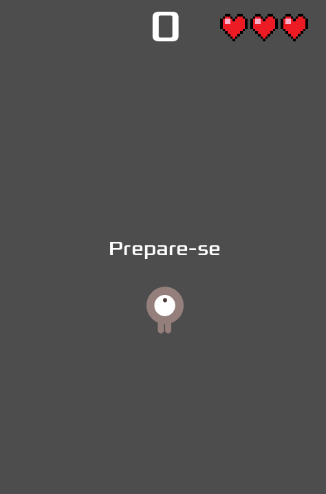

# Dodge the Creeps

Projeto desenvolvido como estudo utilizando a documentação oficial da engine Godot.

O objetivo deste projeto é aprender conceitos fundamentais de desenvolvimento de jogos 2D, organização de cenas, sinais, movimentação, HUD, spawn de inimigos e estruturação de gameplay utilizando a Godot.

Além do conteúdo base da documentação, novas funcionalidades estão sendo adicionadas com foco em aprendizado e experimentação.

## Tecnologias

* Godot Engine
* GDScript

## Objetivos de Estudo

* Estruturação de projetos na Godot
* Sistema de movimentação
* Instanciação de cenas
* Uso de sinais (signals)
* HUD e interface
* Controle de inimigos
* Game loop
* Organização de código
* Boas práticas em projetos pequenos

## Funcionalidades Implementadas

* Movimentação do jogador
* Spawn de inimigos
* Sistema de pontuação
* Tela de Game Over
* Sistema de vida

## Imagens do Projeto

### Gameplay

### HUD

### Sistema de Vida

## Paleta de Cores

O projeto utiliza uma paleta híbrida, combinando tons terrosos para personagens e elementos de perigo, com uma base marítima para fundo e interface.

### Personagens e elementos principais

- Inimigos (corpo): `#4a3632`
- Inimigos (olhos): `#dd4e54` com detalhes em `#ffffff`

- Jogador (corpo): `#947f7c`
- Jogador (olhos): branco com detalhe `#4b3733`

- HUD de vida (corações): `#ee161f`

### Interface e fundo (tema marítimo)

- Fundo (top highlight): `#2a6f7a`

#### UI (interface do jogo)

- Texto principal: `#e8f6f9`

**Botões:**
- Base: `#1f4e5f`
- Hover: `#2f6f82`
- Pressionado: `#163843`
- Borda: `#86c5d8`

## Propósito

Este projeto não possui objetivo comercial.

Ele está sendo utilizado como laboratório pessoal de estudos para aprofundar conhecimentos em desenvolvimento de jogos, lógica de gameplay e arquitetura utilizando Godot.

## Referência

Projeto inspirado e iniciado a partir da documentação oficial da Godot:

* https://docs.godotengine.org/
