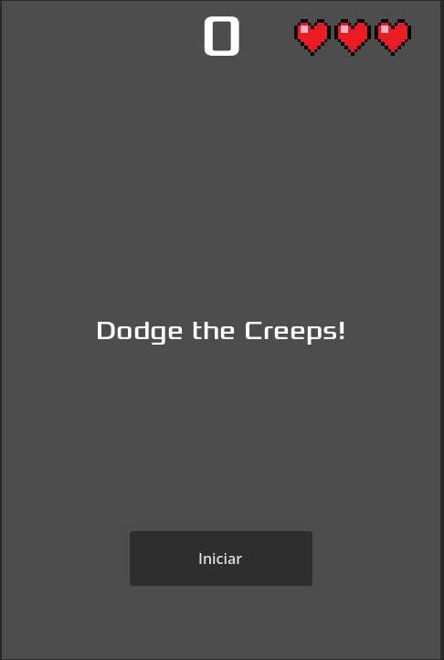
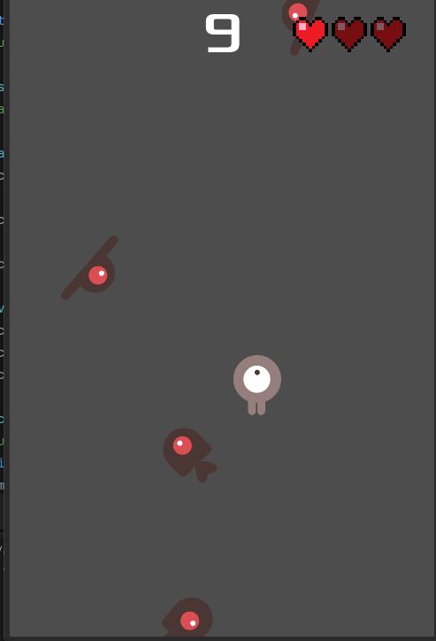

# Dodge the Creeps

Projeto desenvolvido como estudo utilizando a documentação oficial da engine Godot.

O objetivo deste projeto é aprender conceitos fundamentais de desenvolvimento de jogos 2D, organização de cenas, sinais, movimentação, HUD, spawn de inimigos e estruturação de gameplay utilizando a Godot.

Além do conteúdo base da documentação, novas funcionalidades estão sendo adicionadas com foco em aprendizado e experimentação.

## 🚀 Tecnologias

* Godot Engine
* GDScript

## 📚 Objetivos de Estudo

* Estruturação de projetos na Godot
* Sistema de movimentação
* Instanciação de cenas
* Uso de sinais (signals)
* HUD e interface
* Controle de inimigos
* Game loop
* Organização de código
* Boas práticas em projetos pequenos

## 🛠 Funcionalidades Implementadas

* Movimentação do jogador
* Spawn de inimigos
* Sistema de pontuação
* Tela de Game Over
* Sistema de vida

## 📸 Imagens do Projeto

### Gameplay

### HUD

### Sistema de Vida

## 🎯 Propósito

Este projeto não possui objetivo comercial.

Ele está sendo utilizado como laboratório pessoal de estudos para aprofundar conhecimentos em desenvolvimento de jogos, lógica de gameplay e arquitetura utilizando Godot.

## 📖 Referência

Projeto inspirado e iniciado a partir da documentação oficial da Godot:

* https://docs.godotengine.org/